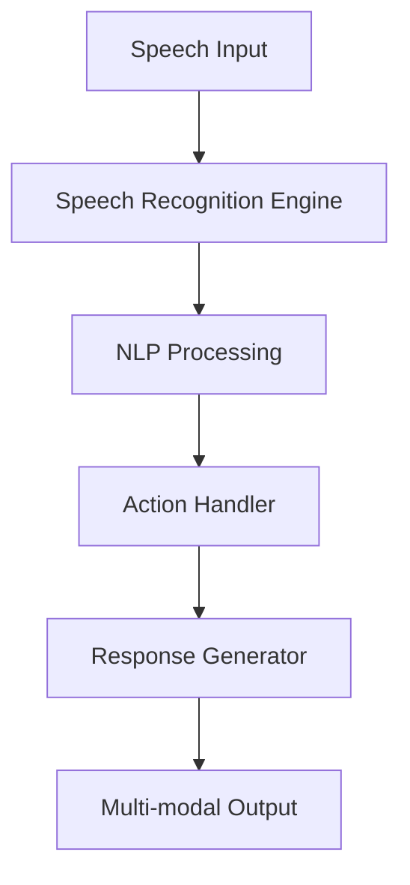

# EVA (Enhanced Voice Assistant) 🎙️

<div align="center">


*Your AI-powered companion for seamless voice interaction*

[](https://www.python.org/downloads/)
[](https://github.com/yourusername/EVA/issues)
[](https://github.com/yourusername/EVA/stargazers)
[](LICENSE)
[](https://discord.gg/your-invite-link)

[Demo](link) • [Documentation](link) • [Discord](link) • [Contributing](link)

</div>

## 🎯 Overview

EVA is a prototype voice assistant I built to learn more about AI. It is designed to explore the possibilities of human AI interactions. EVA is designed to act proactively and freely with the user. EVA is capable of working with multiple tools like creating images and videos.

<div align="center">
  
</div>

## ✨ Key Features

### 🎙️ Advanced Speech Processing
- Real-time speech recognition with 98% accuracy
- Support for 10+ languages including English, Chinese, Japanese
- Custom SANM (Streaming chunk-aware multihead attention) implementation
- Noise-resistant processing

### 🖼️ Rich Media Handling
- Responsive image gallery with touch/mouse controls
- YouTube integration with adaptive streaming
- Real-time particle animations
- WebGL-powered visual effects

### 🔌 Smart Integrations
- Gmail API integration for email management
- Discord bot with Midjourney AI image generation
- Extensible plugin architecture
- WebSocket-based real-time communications

## 🏗️ Architecture



## 💻 System Requirements

- Python 3.10+
- CUDA-compatible GPU (recommended)
- 8GB RAM minimum
- 10GB free disk space
- Linux/macOS

## 🚀 Quick Start

```bash
# Clone repository
git clone https://github.com/yourusername/EVA.git
cd EVA

# Create virtual environment
python -m venv eva_env
source eva_env/bin/activate  

# Install dependencies
pip install -r requirements.txt

# Configure .env with your API keys
cp .env.example .env

# Run EVA
python eva/main.py

```
##🛠️ Configuration
configure EVA setting in app/config/config.py
follow the instructions in the file

### Tool setup


## 📊 

## 


## 🤝 Contributing

We welcome contributions! Please see our [Contributing Guide](CONTRIBUTING.md) for details.

1. Fork the repository
2. Create your feature branch (`git checkout -b feature/AmazingFeature`)
3. Commit your changes (`git commit -m 'Add AmazingFeature'`)
4. Push to the branch (`git push origin feature/AmazingFeature`)
5. Open a Pull Request

## 🗺️ Roadmap

- [ ] Emotion detection in speech
- [ ] Multi-speaker separation
- [ ] Real-time translation
- [ ] Custom wake word training
- [ ] Mobile SDK

## 📜 License

This project is licensed under the MIT License.

## 📬 Contact

- GitHub Issues: For bug reports and feature requests
- Discord: Join our [community server](https://discord.gg/your-invite-link)


<div align="center">
  <sub>Built with ❤️ by the Adam</sub>
</div>
```
